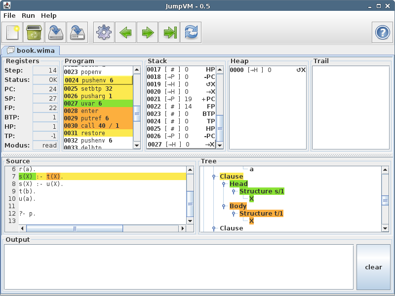

JumpVM
======

JumpVM is "The Java Unified Multi Paradigm Virtual Machine", a gui, parser, compiler and VM for several different programming languages and paradigms.

The main goal of this tool is to support the "Einführung in den Übersetzerbau" and "Übersetzung fortgeschrittener Sprachkonzepte" lectures of Ulm University.

The names and capabilities of the different languages ( PaMa,  MaMa,  WiMa and  BfMa) orient themselves toward the book "Übersetzerbau - Theorie, Konstruktion, Generierung" by R. Wilhelm and D. Maurer which is used in said lectures.

Getting started
---------------

* Open an example file: Select ≡ File → Example → MaMa → example01.mama
* Compile the program: Click on  or select ≡ Run → Compile
* Run the program: Click on  or select ≡ Run → Run

Menus
-----

* File
    *  **New:** Create a new VM of the given type.
    *  **Open:** Create a new VM of the given type and read the source code from a file.
    *  **Example:** Create a new VM of the given type and load example source code.
    *  **Save:** Save the source code of the current tab to a file.
    *  **Save as:** Save the source code of the current tab to a different file.
    *  **Export dot:** Export the source code's abstract syntax tree (given it compiles) as a [graphviz](http://www.graphviz.org/) "dot" file.
    *  **Export asm:** Export the compiled mnemonics to a file.
    *  **Close tab:** Close the current tab.
    *  **Quit:** Exit the program.
* Edit
	*  **Registers:** Edit the values of the current VM's registers.
	*  **Memories:** Edit the elements in the current VM's memory.
* Run
    *  **Compile:** Compile the source code into mnemonics fit to be run in the current VM.
    *  **Step backward:** Goes back one step on the current VM.
    *  **Step forward:** Execute the next step on the current VM / start executing.
    *  **Run:** Executes the VM in "fast forward" mode.
    *  **Reset:** Reset the VM.
* Help
    *  **Help:** Help text.
    *  **About:** Author and license information.

Toolbar
-------

*  **New tab:** Create an empty tab.
*  **Close tab:** Same as ≡ File → Close tab.
*  **Save:** Same as ≡ File → Save.
*  **Save as:** Same as ≡ File → Save as.
*  **Compile:** Same as ≡ Run → Compile.
*  **Step backward:** Same as ≡ Run → Step backward.
*  **Step forward:** Same as ≡ Run → Step forward.
*  **Run:** Same as ≡ Run → Run. Shift + click to run without delay.
*  **Reset:** Same as ≡ Run → Reset.
*  **Help:** Same as ≡ Help → Help.

Tabs
----

* **Registers:** A list of registers the current VM has. Move the cursor above a register to get its full name in the tooltip.
* **Program** / **Stack** / **Heap:** These are the different types of memory the current VM has. Once you compile a program you will find the compiled program in "Program" with the current instruction highlighted. The tooltip gives a short explanation of each instruction. Click on an instruction to highlight the originating node in the abstract syntax tree and text passage in the source code. Values in the "Stack" and "Heap" portions of memory show their type and value as well as a short description of the value's meaning.
* **Source:** You can enter your program source code here or load source code via ≡ File → Open. Use the  button in the toolbar to turn this sourcecode into mnemonics. 
* **Tree:** Once you compile a program, this area will show the program's abstract syntax tree. Click on a node to highlight the origin passage in the source code and the created instructions in the program memory from this node. 
* **Output:** Programs that generate output will display it here. 

Limits
------

*  PaMa
	* The PaMa doesn't do static arrays. All arrays are considered dynamic.
	* Case values must start at 0 and be continuous.
	* Input (`readln`) is not supported and does nothing.
*  MaMa
    * The MaMa doesn't do variable reordering in letrec expressions which makes it fail on certain valid programs. See `example2.mama`.
*  WiMa
    * The WiMa doesn't do lists, see `sublist.wima` for an example of explicit lists.
    * The WiMa doesn't do arithmetic evaluates, especially the predicate `is/2` is missing.
*  BfMa
    * Only the positive half of the infinite band is accessible.
    * Input (character `,`) is not supported yet and does nothing.

License
-------
* Code: (c) 2013, 2014 Tim Wiederhake, licensed under GPLv3 or greater.
* Art: [Tango](http://tango.freedesktop.org/), licensed under CC0.
